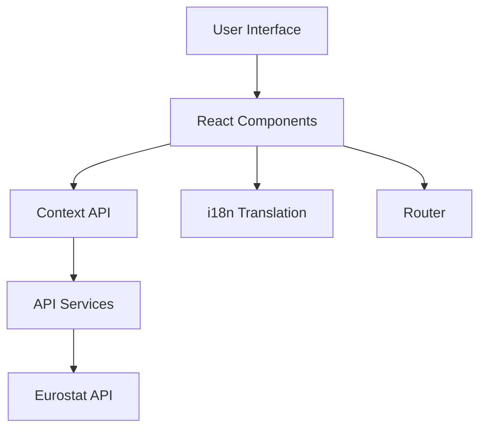

# Energy Visualization Portal

A React-based web application for visualizing energy data across the European Union. This portal provides interactive tools for exploring electricity prices, energy flows, monthly trends, and trade patterns.

## Features

- 🌍 Multi-language support (English, German, French)
- 📊 Multiple visualization tools:
  - Sankey diagrams for energy flows
  - Monthly energy data trends
  - Energy trade configurations
  - Energy balances
  - Energy price comparisons
  - Energy indicators dashboard
- ♿ Accessibility compliant (WCAG 2.1)
- 🎨 ECL (Europa Component Library) design system
- 📱 Responsive design
- 🔄 Real-time data integration with Eurostat APIs

## Technical Stack

### Core Technologies

- **React 18.2.0**: Frontend library for building user interfaces
- **Vite 6.0.5**: Next generation frontend tooling
- **SWC**: Rust-based platform for faster compilation

### Key Libraries

- **Routing & Navigation**

  - `react-router-dom`: v7.1.3 for client-side routing
  - `react-joyride`: v2.9.3 for guided tours

- **State Management & Data Fetching**

  - `axios`: v1.7.9 for HTTP requests
  - Context API for state management

- **Internationalization**

  - `i18next`: v24.2.1
  - `react-i18next`: v11.18.6
  - Support for dynamic language switching

- **UI Components & Styling**

  - `@ecl/preset-eu`: v4.0.0 (Europa Component Library)
  - `@fortawesome/react-fontawesome`: v0.2.2 for icons
  - `react-tooltip`: v5.28.0
  - `react-toastify`: v11.0.3 for notifications

- **Development Tools**
  - `eslint`: v9.17.0 for code linting
  - `prettier`: v3.4.2 for code formatting
  - `@types/react`: v18.3.18 for TypeScript definitions

### Data Flow Architecture



## Project Structure

src/
├── components/ # React components
├── locales/ # Translation files
├── styles/ # CSS styles
├── config/ # Configuration files
├── utils/ # Utility functions
├── hooks/ # Custom React hooks
├── contexts/ # React contexts
└── assets/ # Static assets

## Key Components

- `Navbar`: Main navigation with language switcher and sharing options
- `Card`: Reusable component for displaying visualization tools
- `Modal`: Configurable modal dialog for tool settings
- `Select`/`MultiSelect`: Form components with accessibility features
- `Spinner`: Loading indicator with ARIA support
- `ErrorBoundary`: Global error handling component

## Internationalization

The application uses `i18next` for internationalization with support for:

- English (en)
- German (de)
- French (fr)

Translation files are located in `src/locales/{lang}/translation.json`

## Accessibility Features

- ARIA labels and roles
- Keyboard navigation support
- Focus management
- Screen reader announcements
- High contrast support
- Semantic HTML structure

## Getting Started

1. Install dependencies:

```bash
npm install
```

2. Start development server:

```bash
npm run dev
```

3. Build for production:

```bash
npm run build
```

4. Preview production build:

```bash
npm run preview
```

5. Lint code:

```bash
npm run lint
```

## Environment Setup

bash
Install dependencies
npm install
Development server
npm run dev
Production build
npm run build
Preview production build
npm run preview
Lint code
npm run lint


## Dependencies

- React 18+
- Vite
- i18next
- React Router
- ECL Components
- FontAwesome
- React-Toastify
- Axios
- React-Helmet-Async

## Browser Support

- Chrome (latest)
- Firefox (latest)
- Safari (latest)
- Edge (latest)
- IE11 (basic support)

## Contributing

1. Fork the repository
2. Create a feature branch
3. Commit changes
4. Push to the branch
5. Create a Pull Request

## License

This project is licensed under the European Union Public License (EUPL) version 1.2

## Contact

For questions or support, please contact [Eurostat Support](https://ec.europa.eu/eurostat/help/support)

### Component Architecture

The application follows a modular component architecture:

1. **Container Components**

   - `App.jsx`: Root component
   - `CardsContainer.jsx`: Manages visualization tool cards

2. **Feature Components**

   - `Sankey.jsx`: Energy flow diagrams
   - `Enmonthly.jsx`: Monthly data visualization
   - `Entrade.jsx`: Trade flow visualization
   - `Enbal.jsx`: Energy balance visualization
   - `Enprices.jsx`: Price comparison tools
   - `Endash.jsx`: Dashboard visualization

3. **Common Components**
   - `Modal.jsx`: Reusable modal dialog
   - `Select.jsx`: Enhanced select input
   - `MultiSelect.jsx`: Multiple selection component
   - `Spinner.jsx`: Loading indicator
   - `ErrorBoundary.jsx`: Error handling

### Build and Development

```bash
# Install dependencies
npm install

# Development server
npm run dev

# Production build
npm run build

# Preview production build
npm run preview

# Lint code
npm run lint
```

### Environment Configuration

Required environment variables:

```env
VITE_API_BASE_URL=your_api_base_url
VITE_VISUALIZATION_URL=your_visualization_url
```

### Performance Optimizations

- SWC for faster compilation
- Code splitting using React.lazy()
- Memoization using useMemo and useCallback
- Optimized bundle size using Vite
- Efficient re-rendering using proper React hooks

### Testing and Quality Assurance

- ESLint for code quality
- Prettier for code formatting
- PropTypes for runtime type checking
- React DevTools for component debugging

## Project Structure

[Rest of the README continues as before...]
